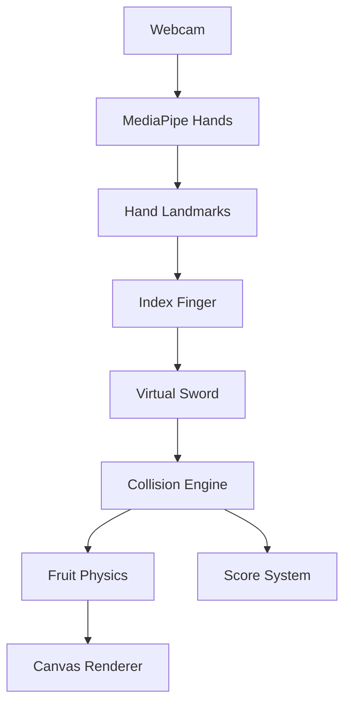

<div align="center">


# 🍉 FruitBlaster AI

### Slice Fruits with Your Hands Using AI Computer Vision

**A next-generation browser game powered by Google MediaPipe that transforms your hand into a virtual sword.**

No Mouse • No Controller • Just AI ✨

<br>

### 🌐 Live Demo

## https://fruit-blaster-ai-fruit-blaster.vercel.app/

<br>


</div>

---

# 🎮 About FruitBlaster AI

FruitBlaster AI is a premium AI-powered browser game inspired by the iconic Fruit Ninja experience. Unlike traditional games that require a mouse or touchscreen, FruitBlaster AI uses **Google MediaPipe Hand Tracking** to transform your real hand into a virtual sword.

Using only your webcam, the game detects your index finger in real time and converts your movements into precise slicing actions. Every slash is processed locally in the browser, delivering a smooth, immersive, and controller-free gaming experience.

The project combines modern web development, computer vision, real-time animation, and interactive game design into a single application.

---

# ✨ Features

## 🤖 AI Hand Tracking

- Real-time hand detection
- Google MediaPipe Hands
- Webcam-based gameplay
- Index finger tracking
- Smooth cursor prediction
- Low latency movement
- Controller-free gaming

---

## ⚔️ Sword System

- Legendary sword skins
- Dynamic slash trails
- Particle effects
- Realistic slicing animation
- Responsive controls

---

## 🍎 Fruit Physics

- Random spawning
- Multiple fruit varieties
- Physics-based movement
- Rotation animation
- Dynamic trajectories

---

## 💣 Bomb Mechanics

- Random bomb spawning
- Explosion animations
- Life reduction
- Increasing difficulty

---

## ❤️ Game System

- Score tracking
- Combo multipliers
- Life counter
- High score
- Accuracy tracking
- Smooth difficulty progression

---

# 🌏 Explore Five Legendary Worlds

Every world has its own visual style, soundtrack, atmosphere, swords, and gameplay.

---

## ⛩️ Dojo Gate

Classic Mode

- Traditional Japanese dojo
- Beginner friendly
- Balanced gameplay
- Samurai atmosphere

---

## 🎋 Bamboo Grove

Zen Mode

- Peaceful bamboo forest
- Relaxing gameplay
- No bombs
- Meditation-inspired environment

---

## 🔥 Crimson Temple

Arcade Mode

- Lava environment
- Inferno blade
- Fast fruit spawning
- Explosive effects

---

## 🌙 Moon Shrine

Survival Mode

- Moonlit shrine
- Celestial visuals
- Harder enemies
- Magical atmosphere

---

## 👑 Imperial Palace

Challenge Mode

- Royal palace
- Legendary swords
- Maximum difficulty
- Premium effects

---

# 🧠 How AI Works

```
Webcam
   │
   ▼
MediaPipe Hands
   │
   ▼
21 Hand Landmarks
   │
   ▼
Index Finger Detection
   │
   ▼
Coordinate Mapping
   │
   ▼
Virtual Sword
   │
   ▼
Collision Detection
   │
   ▼
Fruit Slice
   │
   ▼
Score Update
```

---

# 🏗 Architecture



---

# 🚀 Tech Stack

| Category | Technology |
|-----------|------------|
| Frontend | React |
| Language | TypeScript |
| Bundler | Vite |
| Computer Vision | Google MediaPipe |
| Graphics | HTML5 Canvas |
| Styling | CSS3 |
| Deployment | Vercel |
| Version Control | GitHub |

---

# 📁 Project Structure

```
FruitBlaster-AI

docs/
│
├── banner.jpg
├── gameplay.gif
├── landing-page.png
├── dojo-gate.png
├── bamboo-grove.png
├── crimson-temple.png
├── moon-shrine.png
└── imperial-palace.png

public/

src/

├── assets/
├── components/
├── game/
├── mediapipe/
├── hooks/
├── physics/
├── particles/
├── worlds/
├── pages/
├── styles/
└── utils/

README.md
package.json
```

---

# ⚙️ Installation

Clone the repository

```bash
git clone https://github.com/YOUR_USERNAME/FruitBlaster-AI.git
```

Move into project

```bash
cd FruitBlaster-AI
```

Install packages

```bash
npm install
```

Run development server

```bash
npm run dev
```

Production build

```bash
npm run build
```

Preview

```bash
npm run preview
```

---

# ⚡ Performance

- Optimized MediaPipe Pipeline
- 60 FPS Rendering (hardware-dependent)
- Low Latency Input
- Efficient Collision Detection
- GPU Accelerated Canvas Rendering
- Asset Preloading
- Lazy Loading

---

# 🔒 Privacy

FruitBlaster AI processes all webcam data locally inside your browser.

✔ No images are uploaded.

✔ No videos are stored.

✔ No personal data leaves your device.

---

# 🌐 Browser Support

| Browser | Supported |
|----------|-----------|
| Chrome | ✅ |
| Edge | ✅ |
| Brave | ✅ |
| Opera | ✅ |
| Firefox | ⚠️ Limited |

---

# 💡 Why This Project?

FruitBlaster AI demonstrates how artificial intelligence and computer vision can create natural, controller-free interactions in web applications. Rather than relying on conventional input devices, it explores gesture-based gameplay powered entirely by the browser.

The project highlights practical applications of AI in gaming, combining real-time vision models, responsive rendering, and modern frontend development into a polished interactive experience.

---

# 🚧 Challenges

- Maintaining stable hand tracking under different lighting conditions
- Reducing latency between detection and rendering
- Implementing accurate collision detection
- Optimizing particle effects
- Ensuring smooth gameplay across browsers
- Balancing game difficulty while preserving responsiveness

---

# 🚀 Future Roadmap

- Multiplayer Mode
- Online Leaderboards
- Player Profiles
- Achievements
- More Worlds
- Additional Sword Collections
- Seasonal Events
- Voice Commands
- Gesture Customization
- Mobile Support
- AI Difficulty Scaling
- Cloud Save

---

# 🤝 Contributing

Contributions are welcome!

1. Fork the repository.
2. Create a new branch.
3. Commit your changes.
4. Push to your branch.
5. Open a Pull Request.

Please follow clean coding practices and provide meaningful commit messages.

---

# 🙏 Acknowledgements

Special thanks to:

- Google MediaPipe
- React
- TypeScript
- Vite
- HTML5 Canvas API
- The Open Source Community

---

# 📄 License

This project is licensed under the MIT License.

---

# 👨‍💻 Author

## Anmol Mathad


---

<div align="center">

## ⭐ If you enjoyed this project, consider giving it a Star!

**Made with ❤️ using React + TypeScript + Google MediaPipe**

</div>
